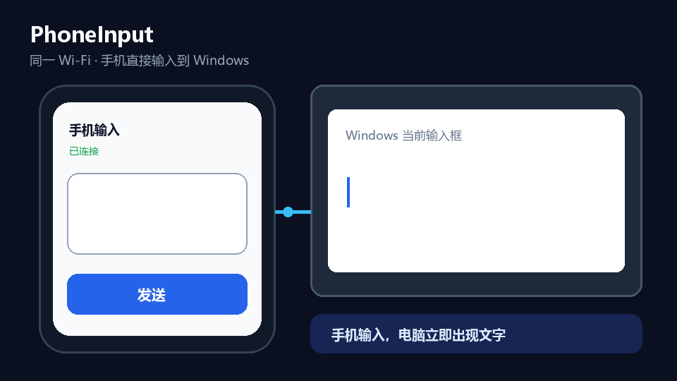

# PhoneInput / 手机输入到电脑



[中文](#中文介绍) · [English](#english)

## 当前最新版：Native 1.4.0

当前主线是 **Windows Native Host + Android 原生客户端**，版本为 `1.4.0`（2026-08-09）。
旧的 C#/.NET 浏览器客户端仍保留在 `src/`，作为历史兼容和回滚线，不再代表最新版。

发布内容位于 [`Release/v1.4.0-native`](Release/v1.4.0-native)：

- Windows x64 Native 包：触控板、鼠标手势、键盘/文字输入、窗口切换、截图、文件传输、图片中转栏、诊断和旧浏览器兼容入口。
- Android Kotlin 原生客户端：单指移动/点击/拖动、双指右键/滚动、原生文字输入、批量与即时输入、输入法语音中转、图片/文件分享。
- Android Debug APK 和未签名 Release APK；正式发布前仍需使用正式 keystore 签名。
- Native Protocol v2，保留旧协议兼容。

### 当前未完成与已知限制

- **回读功能仍然很不完善**：只能在部分目标控件和应用中 best effort 工作；Chrome/浏览器页面、CRX 深度回读和复杂富文本回读仍未完成，不能按“完整回读”宣传。
- Android 真机安装升级、锁屏/切后台/断网恢复，以及百度、搜狗、Gboard 等输入法兼容性仍需继续实机验证。
- 图片中转栏在不同 DPI/多显示器上的显示，以及拖入实际 ChatGPT/Chrome 页面尚未完成完整验收。
- Windows Downloads 被重定向或由 OneDrive 接管时，Known Folder 兼容性仍待修复。
- Release APK 当前是未签名包；Native 版本的部分 Windows 输入/热键集成测试在受限环境中失败，不能写成“全部测试通过”。

详细功能清单、验证边界和后续优先级见 [`docs/PHONEINPUT_V1.4.0_RELEASE_NOTES.md`](docs/PHONEINPUT_V1.4.0_RELEASE_NOTES.md)。

## 中文介绍

使用手机输入法，直接向 Windows 当前获得焦点的输入框输入文字。无需安装手机 App，
不使用云端服务，只在同一 Wi-Fi 局域网内运行。

### 功能

- 支持整段发送和即时输入
- 支持中文输入法、Unicode 和 Emoji
- 同步手机光标和文字选区
- 支持插入、替换、删除、剪切和拖动删除
- 支持回车提交以及 `Shift+Enter` 换行
- 手机端提供 Windows 截图快捷键（`Win+Shift+S`）
- 本地二维码快速连接手机
- 可选 Windows 开机启动
- 支持添加到 Android/iPhone 主屏幕
- 仅驻留系统托盘，不弹出电脑虚拟键盘

### 使用要求

- Windows 10 或 Windows 11，x64
- 手机和电脑连接同一个 Wi-Fi
- Android 或 iPhone 上的现代浏览器

Android Chrome 经过了最充分的测试。iPhone Safari 可以完成基本输入，但输入法和选区
的细节可能略有不同。

### 快速开始

1. 从 [Releases](../../releases) 下载 `PhoneInputEnhanced-Windows-x64.zip`。
2. 解压并运行 `PhoneInputEnhanced.exe`。
3. Windows 防火墙询问时，只允许**专用网络**。
4. 右键单击托盘图标，选择**显示连接二维码**。
5. 手机和电脑连接同一个 Wi-Fi，然后用手机扫描二维码。
6. 在电脑上点入目标输入框，再用手机输入。

手机网页可以添加到 Android 或 iPhone 主屏幕。由于局域网页面使用 HTTP，部分浏览器
会创建浏览器快捷方式，而不是完整的离线 PWA；这不影响输入功能。

### 输入模式

- **整段发送**：先在手机上编辑完整文字，再一次发送。
- **即时输入**：中文选词确认、英文字符、删除和选区操作会立即发送。
- **提交并清空**：手机回车会在电脑端提交，并清空手机输入框。
- **换行，不提交**：手机回车发送 `Shift+Enter`；蓝色网页按钮仍会提交并清空。

### 已知限制

- 文字会发送给 Windows 当前获得键盘焦点的控件。
- 普通权限程序不能向管理员权限程序注入输入。
- Windows 登录界面、安全桌面、部分游戏和密码框会拒绝模拟输入。
- 富文本编辑器对 `Ctrl+Home`、选区和 Emoji 边界的处理可能不同。
- 只在电脑上移动光标或编辑文字，可能导致手机预期位置和电脑实际位置不一致。
- 电脑重新连接 Wi-Fi 后本地 IP 可能变化，此时需要重新扫描二维码。

### 编译

安装 .NET 8 SDK，然后运行：

```powershell
dotnet restore .\src\PhoneInput\PhoneInput.csproj --configfile .\NuGet.Config
dotnet build .\src\PhoneInput\PhoneInput.csproj -c Release --no-restore
dotnet publish .\src\PhoneInput\PhoneInput.csproj -c Release -r win-x64 `
  --self-contained false --no-restore -o .\dist
```

发布包必须使用 framework-dependent 模式；目标电脑已安装 .NET 8 Desktop Runtime，禁止使用 `--self-contained true`，禁止把 .NET 运行时打进 ZIP。
底层规则：项目文件必须保持 `SelfContained=false`，发布命令必须使用 `--self-contained false`；任何包含 .NET 运行时的自包含包都不得作为发布包。

### 编译与发布硬性验收

每次更新、重新编译或打包后，必须证明程序能够实际使用；编译成功不等于完成。

- 启动本次生成的确切 `PhoneInputEnhanced.exe`，确认托盘程序正常运行并监听当前 LAN 地址和端口。
- 使用同一 Wi-Fi 下的 Android 手机实际打开 `http://<电脑局域网 IP>:51876/`，确认页面能加载、`/api/status` 可访问，并完成一次真实输入回归。
- 检查与本次 exe 完整路径匹配的 Windows 防火墙入站规则：必须启用并允许 **Private** 网络；不能只检查回环地址或其他历史版本路径。
- 发布 ZIP 中的 exe、版本号、端口、二维码地址和说明必须与本次构建一致；不得把仅在源码 `bin` 目录验证过的文件直接当作发布包。
- 稳定版目录和 tag 必须保持可回滚；preview 验证失败时不得覆盖稳定版。

只有以上真实运行、手机局域网访问和输入回归都通过，才可以称为本次更新可用。

### 隐私

PhoneInput 不包含账号系统、数据分析或云端中转。文字只会通过局域网从手机浏览器发送到
Windows 程序。请勿为它的端口配置路由器公网转发。

## English

Use your phone's input method to type directly into the currently focused input
field on a Windows PC. No Android or iPhone app is required. PhoneInput runs
entirely on the local Wi-Fi network and does not use a cloud service.

### Features

- Batch input and confirmed-text immediate input
- Chinese input methods, Unicode, and Emoji
- Phone caret and text-selection synchronization
- Insert, replace, delete, cut, and drag-delete synchronization
- Enter-to-submit and `Shift+Enter` newline behavior
- Phone shortcut for the Windows screenshot tool (`Win+Shift+S`)
- Local QR code for quick phone connection
- Optional Windows startup
- Android/iPhone home-screen metadata
- Tray-only Windows application with no virtual keyboard

### Requirements

- Windows 10 or Windows 11, x64
- Android or iPhone on the same Wi-Fi as the PC
- A modern mobile browser
- The release ZIP requires the .NET 8 Desktop Runtime

Android Chrome is the most thoroughly tested browser. Safari on iPhone should
support the basic workflow, but input-method and selection details can differ.

### Quick start

1. Download `PhoneInputEnhanced-Windows-x64.zip` from
   [Releases](../../releases).
2. Extract and run `PhoneInputEnhanced.exe`.
3. If Windows Firewall prompts, allow **Private networks** only.
4. Right-click the tray icon and choose **显示连接二维码**.
5. Scan the QR code with the phone while both devices use the same Wi-Fi.
6. Focus the intended input field on Windows, then type from the phone.

The mobile page can be added to the Android or iPhone home screen. Because the
local page uses HTTP, some browsers create a browser shortcut instead of a
fully installable offline PWA. Input functionality is unaffected.

### Input modes

- **整段发送 / Batch**: edit the full text on the phone, then send it.
- **即时输入 / Realtime**: confirmed Chinese text, English characters,
  deletion, and selection operations are sent immediately.
- **提交并清空 / Submit and clear**: phone Enter submits on Windows and clears
  the phone field.
- **换行，不提交 / Newline**: phone Enter sends `Shift+Enter`; the blue web
  button still submits and clears.

### Known limitations

- Input is sent to the Windows control that currently owns keyboard focus.
- A normal-privilege process cannot inject input into an elevated process.
- Windows sign-in, secure desktop, some games, and security fields reject
  simulated input.
- Rich-text editors can interpret `Ctrl+Home`, selection, and Emoji boundaries
  differently.
- Moving the caret or editing only on the PC can make the phone's expected
  position differ from the actual PC position.
- The local IP address can change when the PC reconnects to Wi-Fi; scan the QR
  code again when an old home-screen shortcut stops connecting.

### Build

Install the .NET 8 SDK, then run:

```powershell
dotnet restore .\src\PhoneInput\PhoneInput.csproj --configfile .\NuGet.Config
dotnet build .\src\PhoneInput\PhoneInput.csproj -c Release --no-restore
dotnet publish .\src\PhoneInput\PhoneInput.csproj -c Release -r win-x64 `
  --self-contained false --no-restore -o .\dist
```

The release package is framework-dependent and requires the .NET 8 Desktop
Runtime already installed on Windows. The default local-network service port
is `51876`.

### Mandatory build and release acceptance

Every update, rebuild, or package operation must prove that the resulting
program is usable in practice; a successful compilation alone is not completion.

- Launch the exact `PhoneInputEnhanced.exe` produced by the current build and
  confirm that the tray app runs and listens on the current LAN address and port.
- From an Android phone on the same Wi-Fi, open
  `http://<PC-LAN-IP>:51876/`, verify that the page and `/api/status` load, and
  complete one real input regression.
- Check the Windows inbound firewall rule for the exact executable path: it must
  be enabled and allow the **Private** profile. Do not rely only on loopback
  access or rules for historical versions.
- The executable, version, port, QR address, and documentation in the release
  ZIP must match the current build. A file tested only from `src\bin` must not be
  treated as the release package.
- When the target computer already has the .NET 8 Desktop Runtime, keep
  `SelfContained=false` and use `--self-contained false`. Never generate or ship
  a self-contained ZIP with the .NET runtime bundled inside.
- Keep stable release directories and tags rollback-safe; never overwrite a
  stable release when preview validation fails.

Only after real runtime, phone LAN access, and input regression all pass may the
update be described as usable.

### Privacy

PhoneInput does not contain an account system, analytics, or cloud relay.
Text is sent directly from the phone browser to the Windows program over the
local network. Do not configure router port forwarding for its port.

## License

MIT. See [LICENSE](LICENSE) and [THIRD-PARTY-NOTICES.md](THIRD-PARTY-NOTICES.md).
